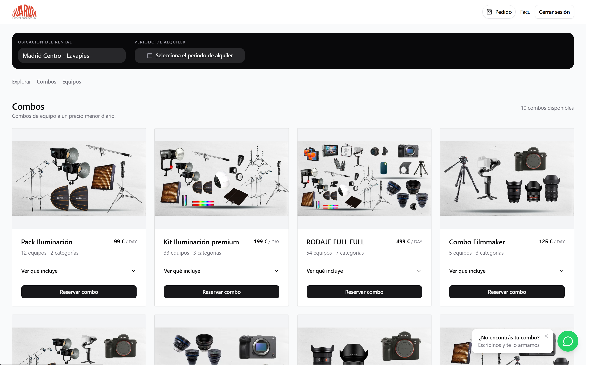
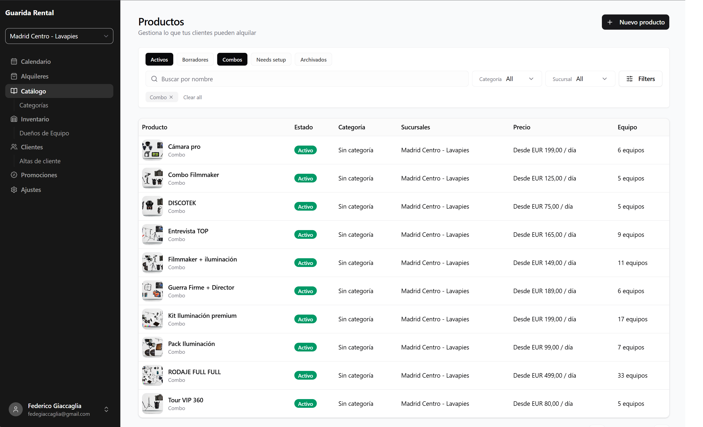

# DEPIQO

Rental management SaaS for equipment rental businesses.

DEPIQO brings together catalog, inventory, pricing, availability, customers, and rental bookings in one system, with a customer-facing storefront and an operational backoffice.

## Product

### Storefront

Customers can browse rentable equipment and combos, choose a rental period, and build a booking using the business's actual catalog, pricing, and availability.

  

### Backoffice

Rental businesses manage their catalog, physical inventory, pricing, customers, and rental operations from a dedicated backoffice.

  

## Core capabilities

- Rental products and equipment combos
- Physical asset inventory
- Branch-specific catalogs and availability
- Rate plans and pricing tiers
- Promotions and coupons
- Customer management
- Rental bookings and asset allocation
- Customer-facing storefront
- Internal operations backoffice

## Engineering highlights

### Availability and concurrent bookings

Rental confirmation uses optimistic asset allocation.

Availability is planned before the persistence transaction to keep transactions short, while a PostgreSQL exclusion constraint remains the final authority preventing the same physical asset from being reserved for overlapping periods.

Concurrent booking conflicts are surfaced as availability failures rather than relying solely on application-level availability checks.

### Pricing engine

Pricing is modeled independently from the storefront and supports:

- rate plans and quantity tiers
- different partial-period billing policies
- percentage and fixed-amount promotions
- free-unit promotions
- coupons
- branch-specific rental offers

Pricing rules remain independent from the storefront and booking flow, allowing the same pricing model to be reused across different application flows.

### Multi-tenant architecture

DEPIQO is designed as a multi-tenant system. Each rental business owns its own branches, catalog, inventory, pricing, customers, bookings, and configuration.

### Domain separation

The backend is organized around domain responsibilities such as:

- Catalog
- Asset Inventory
- Pricing
- Rental Commitments
- Tenant Management

This keeps concepts such as what can be rented, how it is priced, and which physical assets fulfill a booking from becoming one tightly coupled model.

## Tech stack

### Backend

- TypeScript
- NestJS
- Prisma
- PostgreSQL

### Frontend

- TanStack Start
- React
- Tailwind CSS

### Infrastructure

- Railway
- Cloudflare Workers
- Cloudflare R2
